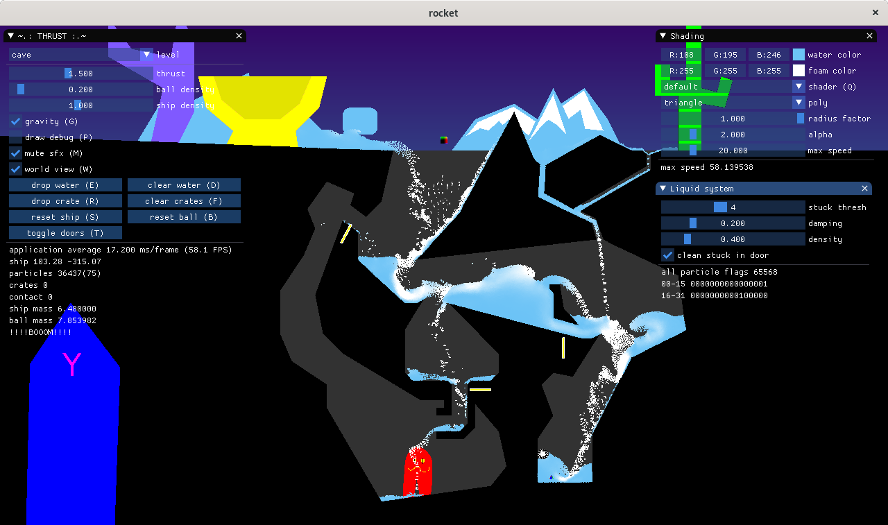

# THRUST2020

Thrust2020 is a sandbox "game" with solid and fluid dynamics.
It uses box2d and liquidfun to provide the user with splashy experience.

## Build instruction

* Install qt5
* Clone repository
* Run `cmake`
* Compile project using `make` or IDE

## Adding new level

* Copy existing `map*.svg`
* Edit new svg file with inkscape for example. Horizontal guide is located at horizon.
* Black filled polygon are solid in game.
* Save file in repository root directory.
* Add svg file in `rocket.qrc` resource file
* Add level description in `levels.json`
    * `name` is displayed on the UI
    * `map` refers to the svg file preceded by a semicolon.
    * Add doors and and paths optionally.
* Build project and run `rocket`
* ...
* Profit

